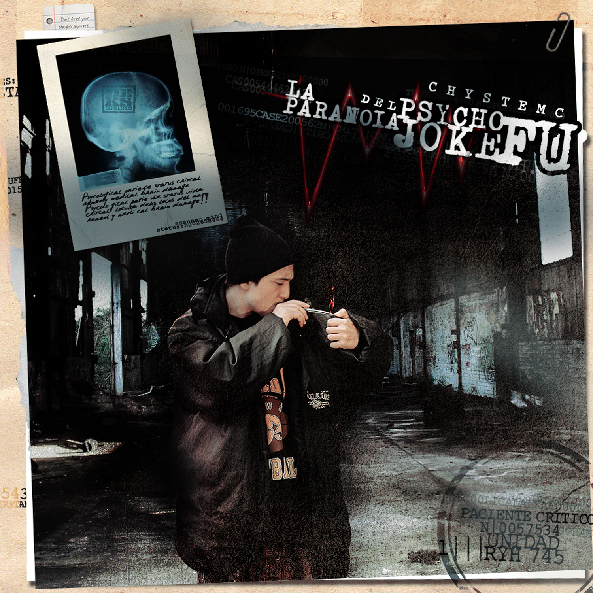

**solemne-02**
*Integrantes del grupo*
Franco Moya 

La Paranoia del Psycho Joke Fú
2010
Chyste MC
1. Pa'eso vine -- Chystemc feat. DJ Transe (03:09)
2. La pura pulentaaa (03:04)
3. En bolá de lah laah laaah (02:45)
4. Sentado en la arena -- Chystemc feat. DJ Transe (03:05)
5. Hay un animal en la capital (02:52)
6. Your Eyes me están gritando (03:08)
7. Real Rap Represent (02:36)
8. A 2 centímetros del suicidio -- Chystemc feat. Singu (03:06)
9. Mic on fesion (03:12)
10. The Prophecy -- Chystemc feat. Tom Morguez (02:24)
11. Me fume uno con la Erykah -- Chystemc feat. DJ Transe (01:39)
12. Razón o zoronca (03:08)
13. Puro shhhile -- Chystemc feat. Ley 20Mil & DJ Transe (04:05)
14. Freestyle shhhrankilein (01:50)
15. Qué más que eso (03:53)
16. Exiliados -- Chystemc feat. MC Unabez, Mantoi, Cevlade, Gran Rah, El Tipo (05:54)
17. Y.E.R.B.A (03:18)
18. Las niñas blancas no tan blancas -- Chystemc feat. Cronelnegro (03:35)
19. Mejor viajar ke llegar (03:15)
20. All the Time -- Chystemc feat. DJ Transe, Jonas Sanche, Hexsagon, Casto (02:50)
21. Mic onfesion -- Chystemc feat. Macrodee (03:11)
22. El won de rojo (03:47)

**premisa**
1. quiero tomar de referencia el fondo del disco y el estilo collage que tiene.
2. tomar el concepto de depresion y desorientacion y representarlo mediante vicios
3. jugar arto con la tipografia, que aparezca de forma dinamica y random pero legible
4. poner una frase principal sacada de una cancion que dice "ella se levanta que bueno llego un nuevo dia, pero creo que eso es lo que menos queria"

**conclusion de premisa**
me organize horrible, no alcanze hacer nada de lo que queria.

**declaracion de IA**
me apoyo con el chat gpt, le hago preguntas especificas cuando no me funciona el codigo para luego intentar solucionarlo pero nunca copio y pego el codigo entero que me suelta devuelta.
aveces lo uso como si fuese la biblioteca de p5js, por ejemplo: le pregunto como hacer que una figura "lata" y me lo explica altiro, entonces me ahorro tiempo enves de estar buscando en la biblio guia de p5js

link solemne p5js https://editor.p5js.org/spiderm8nkey/sketches/luucNANUe